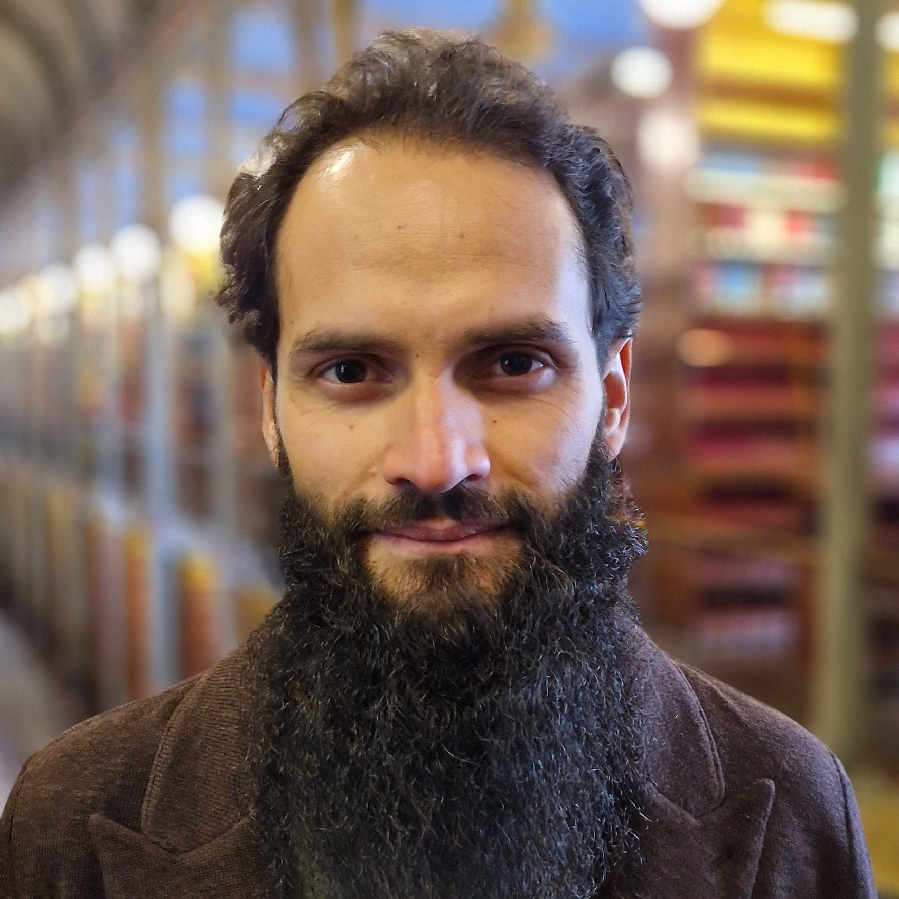

::: {.bio-columns}

::: {.bio-text}
## Short Bio
Sandro is a Complexity & Network Scientist focusing on sociospatial complexity, population dynamics, and socioeconomic inequalities. He is an Assistant Professor at the Copenhagen Center for Social Data Science
([SODAS](https://sodas.ku.dk/)) and Associate at the Copenhagen [Health Complexity Center](https://www.healthcomplex.dk/). His work focuses on societal issues emerging from population dynamics, with a focus on vulnerable groups, utilising methods from complexity, networks, social science, data science, spatial analysis, and experimental design. He has researched urban transportation, ethnic segregation, spatial complexity, unequal epidemic incidence, and inequalities in science. He holds a PhD in Mathematical Sciences from Queen Mary University of London and MSc in complex systems modelling from University of Sāo Paulo.
:::

::: {.bio-photo}
{fig-alt="Sandro Sousa"}
:::

:::

::: {.bio-long}
## Long Bio
Sandro is a multidisciplinary researcher grounded in complexity and network science. He is driven by a curiosity to understand the mechanisms behind issues emerging from population dynamics, merging breadth and depth of knowledge for a pluralist approach. His vision is to use this curiosity drive and science to help the most vulnerable in society by understanding socioeconomic inequalities.

He draws approaches from a wide multidisciplinary toolset, including network science, stochastic processes, computational simulations, randomised trials, surveys, text as data, web scraping, and spatial analysis. His research spans topics of ethnic segregation, epidemic spreading, health image classification, unequal incidence of epidemics, spatial complexity, and gender inequalities in science. Currently, he is an Assistant Professor at the Copenhagen Center for Social Data Science ([SODAS](https://sodas.ku.dk/)), University of Copenhagen. He is also affiliated with the Copenhagen [Health Complexity Center](https://www.healthcomplex.dk/).

He has a PhD in Complex Systems at The School of Mathematical Sciences, [Queen Mary University of London](https://www.qmul.ac.uk/maths/), with supervision by [Vincenzo Nicosia](http://www.maths.qmul.ac.uk/~vnicosia). He obtained his MSc in Complex Systems Modelling at [University of São Paulo](http://www5.each.usp.br/mestrado-academico-em-modelagem-de-sistemas-complexos/). Before the research career, he worked on IT consulting and data solutions for more than 7 years.

<!-- <a href="files/cv_ssousa.pdf" class="btn-cv">Download CV</a> -->
:::

::: {.bio-contact}
## Find me

**Address**: University of Copenhagen, Øster Farimagsgade 5, 1353 København, Denmark

**Office**: [SODAS](https://sodas.ku.dk/contact/)

<a href=https://cal.com/sandrofsousa/flex class="btn-cv">Book a meeting</a>
:::
